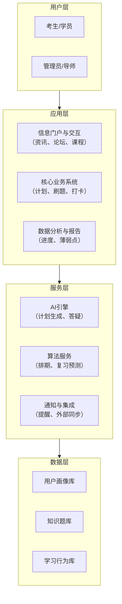

针对北京大学高性能计算方向考研的全流程，可以将其设计为一个**数据驱动的闭环管理系统**。其核心逻辑是：**计划 → 执行 → 评估 → 调整**。

下面是一套可供参考的业务流程架构设计，以及相应的自动化方案建议。

### 🏗️ 业务流程架构设计

这套架构可以抽象为四个核心层，层层递进，形成闭环。

各层功能如下：

*   **1. 用户层 (User Layer)**：系统的最终使用者，包括备考的考生和管理系统的导师或管理员。
*   **2. 应用层 (Application Layer)**：直接面向用户的功能模块。
    *   **信息门户与交互**：提供考研资讯、论坛交流和课程视频学习等功能，是一站式服务的入口。
    *   **核心业务系统**：这是系统的中枢，负责**生成每日/每周学习计划**、**提供在线刷题与即时批改**、**跟踪进度打卡**，并**自动收集错题、分析薄弱知识点**。
    *   **数据分析与报告**：将学习数据可视化，生成各科正确率趋势、知识点掌握情况等报告，为调整策略提供依据。

*   **3. 服务层 (Service Layer)**：为应用层提供智能化支持的后端服务。
    *   **AI引擎**：利用大模型（如DeepSeek）提供智能答疑、自动生成答案解析、进行知识盲区分析等。
    *   **算法服务**：内置科学的学习算法，如基于**FSRS-5**或**SM-2**的**间隔重复算法**来优化复习安排，以及基于认知科学的**时间块分割**来制定计划。
    *   **通知与集成**：负责学习任务推送，并支持与外部笔记工具（如FlowUs、Notion）同步数据。

*   **4. 数据层 (Data Layer)**：系统的数据基础。
    *   **用户画像库**：存储个人目标、作息类型（早起/夜猫子）、历史学习数据等。
    *   **知识题库**：结构化的题目数据库，包含题目、答案、解析、所属科目和知识点标签。
    *   **学习行为库**：记录所有学习行为，如刷题记录、错题集、打卡日志等，是数据分析的来源。

### 🤖 自动化方案盘点

基于上述架构，可以利用现有工具或自行开发来实现以下自动化方案：

*   **方案一：AI 驱动的智能规划**
    利用AI Agent（如`kaoyan-plan`）自动生成学习计划。它能根据你的**当前进度、可用时间、疲劳度**等因素，动态调整每日任务。高级功能还包括识别“任务欠账”并启动恢复模式，以及进行心理健康干预（如连续疲惫三天后触发提醒）。

*   **方案二：智能刷题与闭环复习**
    *   **工具**：可使用“408考研AI专属助教”或类似系统。
    *   **流程**：从**PDF题库批量导入**题目 -> **在线刷题，即时批改** -> **自动收集错题**并分析**薄弱知识点** -> 通过**MCP协议**将分析结果同步至**笔记工具**（如FlowUs），形成“刷题→分析→记录→复习”的闭环。

*   **方案三：基于科学算法的复习排期**
    采用**间隔重复算法**（如FSRS-5或SM-2）自动排期。系统会根据你的**答题表现**和**遗忘曲线**，动态计算每个知识点的最佳复习时间，自动生成每日复习列表，实现“更聪明地学习，而非更刻苦”。

*   **方案四：数据看板与进度追踪**
    建立个人学习数据看板，自动追踪各科**正确率变化趋势**、统计**知识点维度的掌握情况**，并计算“备考 readiness score”。这能让你清晰定位强弱项，避免“重刷题轻总结”的误区。

*   **方案五：全流程工作流整合**
    可以利用一些低代码或无代码平台（如“办公小浣熊”）将**资料归档、每日打卡、重复性动作**等通过“Skill”封装整合，打造一个自动化的工作流。

### 💎 总结

一个高效的备考系统，本质上是将**科学的复习方法论**（如间隔重复）与**AI的数据处理能力**相结合。通过上述架构和自动化方案，你可以将大部分重复性、规划性工作交给系统，从而将宝贵的时间和精力聚焦于“学习”这一核心动作本身。